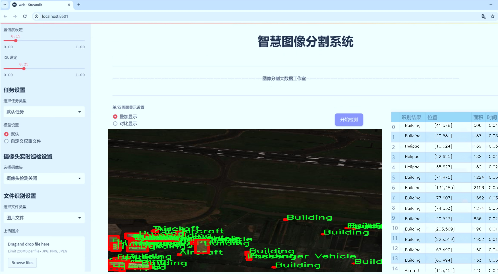
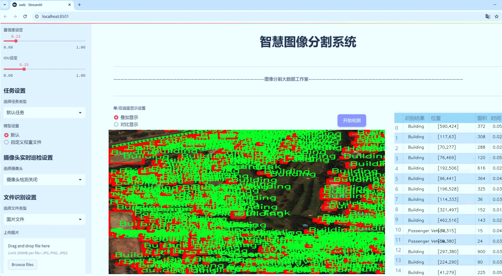
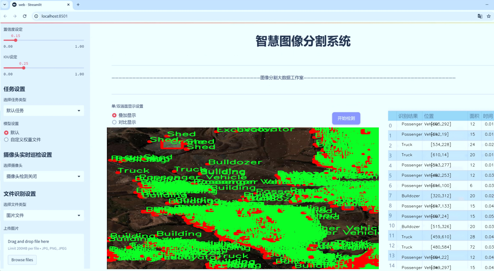
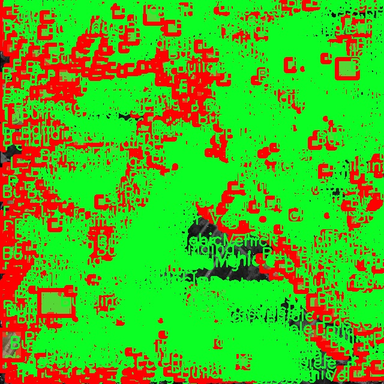
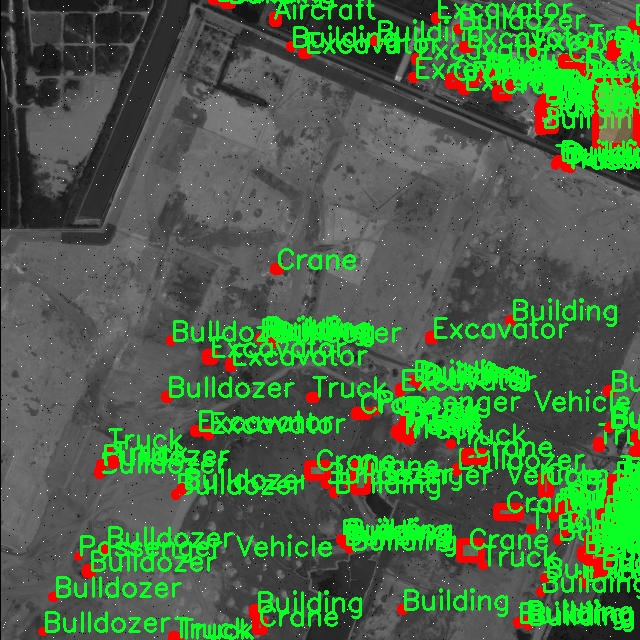
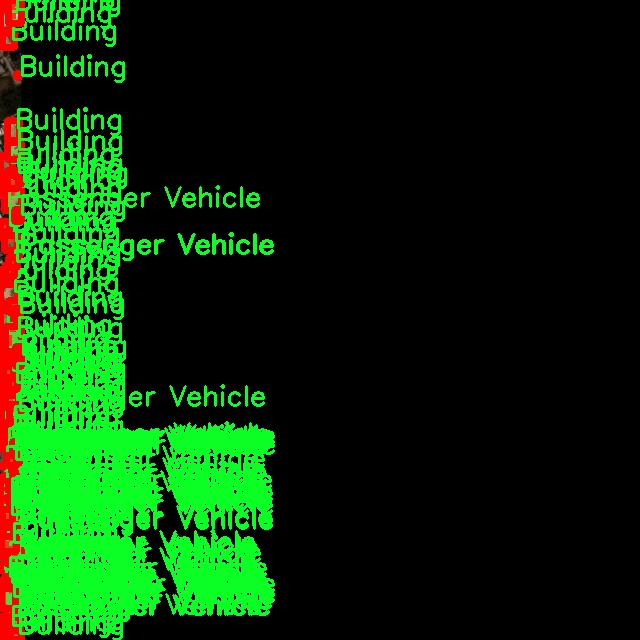
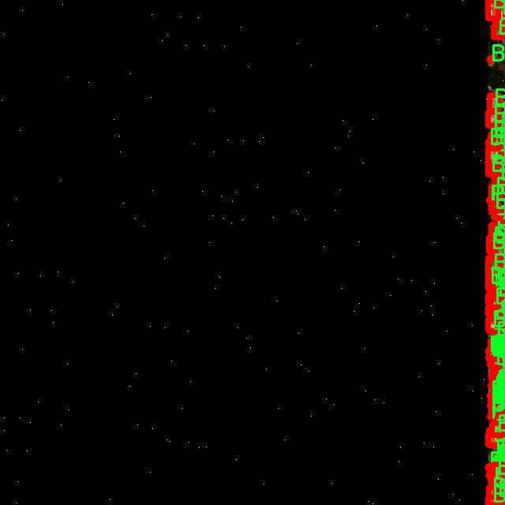
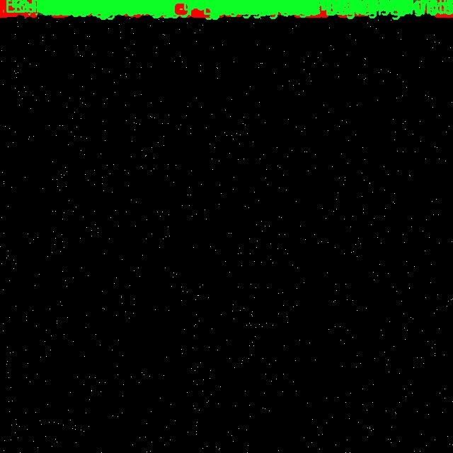

# 航拍图航空器与建筑物分割系统源码＆数据集分享
 [yolov8-seg-C2f-EMSCP＆yolov8-seg-C2f-OREPA等50+全套改进创新点发刊_一键训练教程_Web前端展示]

### 1.研究背景与意义

项目参考[ILSVRC ImageNet Large Scale Visual Recognition Challenge](https://gitee.com/YOLOv8_YOLOv11_Segmentation_Studio/projects)

项目来源[AAAI Global Al lnnovation Contest](https://kdocs.cn/l/cszuIiCKVNis)

研究背景与意义

随着无人机技术的迅猛发展，航拍图像在城市规划、交通管理、环境监测等领域的应用日益广泛。航拍图像的高分辨率和广阔视野为各种目标检测与分割任务提供了丰富的信息。然而，传统的图像处理方法在处理复杂场景时往往面临着精度不足和效率低下的问题。近年来，深度学习技术的快速进步，尤其是目标检测和实例分割领域的突破，为航拍图像的分析提供了新的解决方案。YOLO（You Only Look Once）系列模型因其高效的实时检测能力而受到广泛关注，其中YOLOv8作为最新版本，进一步提升了检测精度和速度，成为航拍图像处理的理想选择。

本研究旨在基于改进的YOLOv8模型，构建一个高效的航拍图航空器与建筑物分割系统。该系统将针对特定的航拍场景进行优化，特别是在复杂的城市环境中，能够准确识别和分割多种目标，包括航空器、建筑物及其他相关设施。研究所使用的数据集包含1800幅图像，涵盖19个类别，如飞机、建筑物、起重机、油罐等，这些类别的多样性为模型的训练和测试提供了丰富的样本，能够有效提升模型的泛化能力。

在实际应用中，航空器与建筑物的准确分割不仅对城市管理和交通规划至关重要，也为应急响应、灾后重建等提供了重要的数据支持。例如，在自然灾害发生后，快速识别受损建筑物和被困航空器的位置，能够为救援行动提供及时的信息，从而提高救援效率。此外，随着智能城市建设的推进，实时监测城市基础设施的状态，及时发现潜在的安全隐患，已成为城市管理的重要任务。本研究所开发的分割系统，能够为这些应用提供强有力的技术支持。

此外，基于YOLOv8的航拍图像分割系统还具有重要的学术意义。通过对现有YOLOv8模型的改进与优化，研究将探索深度学习在实例分割领域的新方法和新思路，推动相关技术的发展。同时，研究将为航拍图像处理领域提供新的数据集和实验结果，丰富现有文献，为后续研究提供参考。

综上所述，本研究不仅在技术上具有重要的应用价值，还在理论上为深度学习与图像处理的结合提供了新的视角。通过对航拍图像中航空器与建筑物的精确分割，研究将为城市管理、环境监测等领域提供强有力的支持，推动相关技术的进步与应用，为智能城市的建设贡献力量。

### 2.图片演示







##### 注意：由于此博客编辑较早，上面“2.图片演示”和“3.视频演示”展示的系统图片或者视频可能为老版本，新版本在老版本的基础上升级如下：（实际效果以升级的新版本为准）

  （1）适配了YOLOV8的“目标检测”模型和“实例分割”模型，通过加载相应的权重（.pt）文件即可自适应加载模型。

  （2）支持“图片识别”、“视频识别”、“摄像头实时识别”三种识别模式。

  （3）支持“图片识别”、“视频识别”、“摄像头实时识别”三种识别结果保存导出，解决手动导出（容易卡顿出现爆内存）存在的问题，识别完自动保存结果并导出到tempDir中。

  （4）支持Web前端系统中的标题、背景图等自定义修改，后面提供修改教程。

  另外本项目提供训练的数据集和训练教程,暂不提供权重文件（best.pt）,需要您按照教程进行训练后实现图片演示和Web前端界面演示的效果。

### 3.视频演示

[3.1 视频演示](https://www.bilibili.com/video/BV19AyzYJESw/)

### 4.数据集信息展示

##### 4.1 本项目数据集详细数据（类别数＆类别名）

nc: 19
names: ['Aircraft', 'Aircraft Hangar', 'Building', 'Bulldozer', 'Crane', 'Excavator', 'Helipad', 'Maritime Vessel', 'Oil Tanker', 'Passenger Vehicle', 'Pylon', 'Railway Vehicle', 'Shed', 'Shipping container', 'Storage Tank', 'Tower', 'Tractor', 'Truck', 'Vehicle Lot']


##### 4.2 本项目数据集信息介绍

数据集信息展示

在本研究中，我们使用了名为“georeferencing_intelligence_data 2”的数据集，以改进YOLOv8-seg模型在航拍图像中对航空器与建筑物的分割能力。该数据集的设计旨在为计算机视觉领域提供高质量的标注数据，特别是在复杂的城市和工业环境中，能够有效地识别和分割多种目标物体。数据集包含19个类别，涵盖了航空器、建筑物及相关设施，确保了在不同场景下的多样性和代表性。

具体而言，数据集中包含的类别包括“Aircraft”（航空器）、“Aircraft Hangar”（飞机库）、“Building”（建筑物）、“Bulldozer”（推土机）、“Crane”（起重机）、“Excavator”（挖掘机）、“Helipad”（直升机停机坪）、“Maritime Vessel”（海洋船舶）、“Oil Tanker”（油轮）、“Passenger Vehicle”（乘用车）、“Pylon”（电塔）、“Railway Vehicle”（铁路车辆）、“Shed”（棚屋）、“Shipping container”（集装箱）、“Storage Tank”（储罐）、“Tower”（塔）、“Tractor”（拖拉机）、“Truck”（卡车）以及“Vehicle Lot”（车辆停放区）。这些类别的选择不仅反映了航空器和建筑物的多样性，还涵盖了与之相关的重型机械和交通工具，为模型的训练提供了丰富的上下文信息。

数据集的图像数据来源于高分辨率的航拍图像，涵盖了不同的地理区域和环境条件。这种多样性使得模型在训练过程中能够学习到更为广泛的特征，进而提高其在实际应用中的泛化能力。每个类别的标注均经过严格审核，确保数据的准确性和一致性，从而为模型的训练提供坚实的基础。

在训练过程中，YOLOv8-seg模型将利用这些标注数据进行特征学习，通过不断优化其参数，以实现对各类目标物体的精确分割。特别是在复杂的城市环境中，模型需要能够有效地区分建筑物与航空器之间的细微差别，同时识别出周围的重型机械和交通工具。这种能力不仅对航空器的监测和管理至关重要，也为城市规划、交通管理和环境监测等领域提供了有力支持。

此外，数据集的设计考虑到了实际应用中的挑战，例如不同光照条件、天气变化以及视角差异等。这些因素可能会影响目标物体的可见性和特征表现，因此在数据集中包含了多种场景和条件，以增强模型的鲁棒性和适应性。通过这种方式，我们希望能够训练出一个不仅在标准测试集上表现优异，而且在真实世界应用中同样有效的分割系统。

综上所述，“georeferencing_intelligence_data 2”数据集为改进YOLOv8-seg模型提供了丰富的训练素材，涵盖了多种类别和复杂环境，为航空器与建筑物的分割任务奠定了坚实的基础。通过充分利用该数据集，我们期望能够提升模型的性能，为相关领域的研究和应用提供更为精确和可靠的解决方案。











### 5.全套项目环境部署视频教程（零基础手把手教学）

[5.1 环境部署教程链接（零基础手把手教学）](https://www.bilibili.com/video/BV1jG4Ve4E9t/?vd_source=bc9aec86d164b67a7004b996143742dc)


[5.2 安装Python虚拟环境创建和依赖库安装视频教程链接（零基础手把手教学）](https://www.bilibili.com/video/BV1nA4VeYEze/?vd_source=bc9aec86d164b67a7004b996143742dc)

### 6.手把手YOLOV8-seg训练视频教程（零基础小白有手就能学会）

[6.1 手把手YOLOV8-seg训练视频教程（零基础小白有手就能学会）](https://www.bilibili.com/video/BV1cA4VeYETe/?vd_source=bc9aec86d164b67a7004b996143742dc)


按照上面的训练视频教程链接加载项目提供的数据集，运行train.py即可开始训练



     Epoch   gpu_mem       box       obj       cls    labels  img_size
     1/200     0G   0.01576   0.01955  0.007536        22      1280: 100%|██████████| 849/849 [14:42<00:00,  1.04s/it]
               Class     Images     Labels          P          R     mAP@.5 mAP@.5:.95: 100%|██████████| 213/213 [01:14<00:00,  2.87it/s]
                 all       3395      17314      0.994      0.957      0.0957      0.0843

     Epoch   gpu_mem       box       obj       cls    labels  img_size
     2/200     0G   0.01578   0.01923  0.007006        22      1280: 100%|██████████| 849/849 [14:44<00:00,  1.04s/it]
               Class     Images     Labels          P          R     mAP@.5 mAP@.5:.95: 100%|██████████| 213/213 [01:12<00:00,  2.95it/s]
                 all       3395      17314      0.996      0.956      0.0957      0.0845

     Epoch   gpu_mem       box       obj       cls    labels  img_size
     3/200     0G   0.01561    0.0191  0.006895        27      1280: 100%|██████████| 849/849 [10:56<00:00,  1.29it/s]
               Class     Images     Labels          P          R     mAP@.5 mAP@.5:.95: 100%|███████   | 187/213 [00:52<00:00,  4.04it/s]
                 all       3395      17314      0.996      0.957      0.0957      0.0845


### 7.50+种全套YOLOV8-seg创新点代码加载调参视频教程（一键加载写好的改进模型的配置文件）

[7.1 50+种全套YOLOV8-seg创新点代码加载调参视频教程（一键加载写好的改进模型的配置文件）](https://www.bilibili.com/video/BV1Hw4VePEXv/?vd_source=bc9aec86d164b67a7004b996143742dc)

### 8.YOLOV8-seg图像分割算法原理

原始YOLOv8-seg算法原理

YOLOv8-seg算法是YOLO系列的最新版本之一，旨在实现高效的目标检测与分割任务。该算法在YOLOv5的基础上进行了多项重要的改进，尤其是在骨干网络、特征融合和损失计算等方面，极大地提升了其性能和应用范围。YOLOv8-seg不仅保留了YOLO系列一贯的高效性和准确性，还引入了更为复杂的特征提取和处理机制，以适应现代计算机视觉任务的需求。

首先，YOLOv8-seg算法在骨干网络的设计上采用了跨级结构（Cross Stage Partial, CSP）的思想，这种设计理念旨在提高特征提取的效率和效果。通过优化YOLOv5中的C3模块，YOLOv8-seg引入了更轻量的结构，降低了计算复杂度，同时保持了特征的丰富性。这种优化使得YOLOv8-seg能够在更低的计算资源下，仍然实现高精度的目标检测与分割。

在特征提取方面，YOLOv8-seg依然利用了空间金字塔池化（SPP）模块，以增强对多尺度目标的检测能力。该模块通过不同尺度的池化操作，能够有效地捕捉到图像中的多层次特征信息。这种多尺度特征融合的方式，使得YOLOv8-seg在处理复杂场景时，能够更好地适应不同大小和形状的目标，提高了算法的鲁棒性。

YOLOv8-seg的另一个重要特点是其特征融合网络的设计。算法采用了双塔结构，将特征金字塔网络与路径聚合网络相结合，促进了语义特征与定位特征的有效转移。这种设计不仅增强了网络的特征融合能力，还使得算法在面对不同尺度的目标时，能够更准确地进行定位和分类。通过这种方式，YOLOv8-seg能够更好地理解图像中的上下文信息，从而提升目标检测和分割的整体性能。

在损失计算方面，YOLOv8-seg引入了新的损失策略，以提高模型的训练效果。通过变焦损失计算分类损失，结合数据平均保真度损失和完美交并比损失，YOLOv8-seg能够更准确地评估边界框的预测效果。这种创新的损失计算方式，使得模型在训练过程中能够更好地优化目标检测与分割的精度，从而在实际应用中表现出色。

YOLOv8-seg还引入了自适应样本匹配机制，以进一步提升目标检测的效率和准确性。通过动态调整样本匹配策略，算法能够更灵活地应对不同场景下的目标分布，确保在高效率的基础上实现高精度的目标检测。这种自适应机制的引入，使得YOLOv8-seg在处理复杂场景时，能够更好地适应变化，提高了算法的通用性。

值得一提的是，YOLOv8-seg的应用场景非常广泛，涵盖了智能监控、自动驾驶、医学影像分析等多个领域。其高效的目标检测与分割能力，使得该算法在实时性要求较高的应用中表现尤为突出。通过对YOLOv8-seg的不断优化与改进，研究者们希望能够进一步提升其在特定任务中的表现，例如口罩检测、行人重识别等。

综上所述，YOLOv8-seg算法通过对骨干网络、特征融合、损失计算和样本匹配等多个方面的优化，展现出了卓越的目标检测与分割能力。其创新的设计理念和高效的实现方式，使得YOLOv8-seg成为当前计算机视觉领域中最具潜力的算法之一。随着技术的不断进步，YOLOv8-seg无疑将在未来的研究与应用中发挥更加重要的作用。


### 9.系统功能展示（检测对象为举例，实际内容以本项目数据集为准）

图9.1.系统支持检测结果表格显示

  图9.2.系统支持置信度和IOU阈值手动调节

  图9.3.系统支持自定义加载权重文件best.pt(需要你通过步骤5中训练获得)

  图9.4.系统支持摄像头实时识别

  图9.5.系统支持图片识别

  图9.6.系统支持视频识别

  图9.7.系统支持识别结果文件自动保存

  图9.8.系统支持Excel导出检测结果数据


### 10.50+种全套YOLOV8-seg创新点原理讲解（非科班也可以轻松写刊发刊，V11版本正在科研待更新）

#### 10.1 由于篇幅限制，每个创新点的具体原理讲解就不一一展开，具体见下列网址中的创新点对应子项目的技术原理博客网址【Blog】：


[10.1 50+种全套YOLOV8-seg创新点原理讲解链接](https://gitee.com/qunmasj/good)

#### 10.2 部分改进模块原理讲解(完整的改进原理见上图和技术博客链接)【如果此小节的图加载失败可以通过CSDN或者Github搜索该博客的标题访问原始博客，原始博客图片显示正常】

### YOLOv8简介
YoloV8模型结构
YOLOv3之前的所有YOLO对象检测模型都是用C语言编写的，并使用了Darknet框架，Ultralytics发布了第一个使用PyTorch框架实现的YOLO (YOLOv3)；YOLOv3之后，Ultralytics发布了YOLOv5，在2023年1月，Ultralytics发布了YOLOv8，包含五个模型，用于检测、分割和分类。 YOLOv8 Nano是其中最快和最小的，而YOLOv8 Extra Large (YOLOv8x)是其中最准确但最慢的，具体模型见后续的图。

YOLOv8附带以下预训练模型:

目标检测在图像分辨率为640的COCO检测数据集上进行训练。
实例分割在图像分辨率为640的COCO分割数据集上训练。
图像分类模型在ImageNet数据集上预训练，图像分辨率为224。
YOLOv8 概述
具体到 YOLOv8 算法，其核心特性和改动可以归结为如下：

提供了一个全新的SOTA模型（state-of-the-art model），包括 P5 640 和 P6 1280 分辨率的目标检测网络和基于YOLACT的实例分割模型。和 YOLOv5 一样，基于缩放系数也提供了 N/S/M/L/X 尺度的不同大小模型，用于满足不同场景需求
骨干网络和 Neck 部分可能参考了 YOLOv7 ELAN 设计思想，将 YOLOv5 的 C3 结构换成了梯度流更丰富的 C2f 结构，并对不同尺度模型调整了不同的通道数，属于对模型结构精心微调，不再是一套参数应用所有模型，大幅提升了模型性能。
Head 部分相比 YOLOv5 改动较大，换成了目前主流的解耦头结构，将分类和检测头分离，同时也从Anchor-Based 换成了 Anchor-Free
Loss 计算方面采用了TaskAlignedAssigner正样本分配策略，并引入了Distribution Focal Loss
训练的数据增强部分引入了 YOLOX 中的最后 10 epoch 关闭 Mosiac 增强的操作，可以有效地提升精度


### HRNet V2简介
现在设计高低分辨率融合的思路主要有以下四种：


（a）对称结构。如U-Net、Hourglass等，都是先下采样再上采样，上下采样过程对称。

（b）级联金字塔。如refinenet等，高低分辨率融合时经过卷积处理。

（c）简单的baseline，用转职卷积进行上采样。

（d）扩张卷积。如deeplab等，增大感受野，减少下采样次数，可以无需跳层连接直接进行上采样。

（b）（c）都是使用复杂一些的网络进行下采样（如resnet、vgg），再用轻量级的网络进行上采样。

HRNet V1是在（b）的基础上进行改进，从头到尾保持大的分辨率表示。然而HRNet V1仅是用在姿态估计领域的，HRNet V2对它做小小的改进可以使其适用于更广的视觉任务。这一改进仅仅增加了较小的计算开销，但却提升了较大的准确度。

#### 网络结构图：


这个结构图简洁明了就不多介绍了，首先图2的输入是已经经过下采样四倍的feature map，横向的conv block指的是basicblock 或 bottleblock，不同分辨率之间的多交叉线部分是multi-resolution convolution（多分辨率组卷积）。

到此为止HRNet V2和HRNet V1是完全一致的。

区别之处在于这个基网络上加的一个head：


图3介绍的是接在图2最后的head。（a）是HRNet V1的头，很明显他只用了大分辨率的特征图。（b）（c）是HRNet V2的创新点，（b）用与语义分割，（c）用于目标检测。除此之外作者还在实验部分介绍了用于分类的head，如图4所示。


#### 多分辨率block：


一个多分辨率block由多分辨率组卷积（a）和多分辨率卷积（b）组成。（c）是一个正常卷积的展开，（b）的灵感来源于（c）。代码中（a）部分由Bottleneck和BasicBlock组成。

多分辨率卷积和正常卷积的区别：（1）多分辨率卷积中，每个通道的subset的分辨率都不一样。（2）通道之间的连接如果是降分辨率，则用的是3x3的2stride的卷积，如果是升分辨率，用的是双线性最邻近插值上采样。


### 11.项目核心源码讲解（再也不用担心看不懂代码逻辑）

#### 11.1 ui.py

以下是代码的核心部分，并附上详细的中文注释：

```python
import sys
import subprocess

def run_script(script_path):
    """
    使用当前 Python 环境运行指定的脚本。

    Args:
        script_path (str): 要运行的脚本路径

    Returns:
        None
    """
    # 获取当前 Python 解释器的路径
    python_path = sys.executable

    # 构建运行命令，使用 streamlit 运行指定的脚本
    command = f'"{python_path}" -m streamlit run "{script_path}"'

    # 执行命令
    result = subprocess.run(command, shell=True)
    # 检查命令执行结果，如果返回码不为0，表示执行出错
    if result.returncode != 0:
        print("脚本运行出错。")

# 实例化并运行应用
if __name__ == "__main__":
    # 指定要运行的脚本路径
    script_path = "web.py"  # 假设脚本在当前目录下

    # 调用函数运行脚本
    run_script(script_path)
```

### 代码分析：
1. **导入模块**：
   - `sys`：用于获取当前 Python 解释器的路径。
   - `subprocess`：用于执行外部命令。

2. **`run_script` 函数**：
   - 接受一个参数 `script_path`，表示要运行的 Python 脚本的路径。
   - 使用 `sys.executable` 获取当前 Python 解释器的路径。
   - 构建一个命令字符串，使用 `streamlit` 运行指定的脚本。
   - 使用 `subprocess.run` 执行命令，并检查返回码以判断脚本是否成功运行。

3. **主程序部分**：
   - 在 `if __name__ == "__main__":` 语句下，确保只有在直接运行该脚本时才会执行以下代码。
   - 指定要运行的脚本路径（这里假设为 `web.py`）。
   - 调用 `run_script` 函数来执行指定的脚本。 

这个代码的核心功能是通过当前 Python 环境来运行一个指定的 Streamlit 脚本，并且在运行出错时提供反馈。

这个文件名为 `ui.py`，它的主要功能是通过当前的 Python 环境来运行一个指定的脚本，具体是使用 Streamlit 框架来启动一个 Web 应用。

首先，文件导入了几个必要的模块，包括 `sys`、`os` 和 `subprocess`。其中，`sys` 模块用于访问与 Python 解释器相关的变量和函数，`os` 模块提供了与操作系统交互的功能，而 `subprocess` 模块则用于创建新进程、连接到它们的输入/输出/错误管道，并获取它们的返回码。

接下来，文件从 `QtFusion.path` 模块中导入了 `abs_path` 函数，这个函数的作用是获取文件的绝对路径。

在 `run_script` 函数中，定义了一个参数 `script_path`，它表示要运行的脚本的路径。函数首先获取当前 Python 解释器的路径，然后构建一个命令字符串，这个命令使用 `streamlit run` 来运行指定的脚本。接着，使用 `subprocess.run` 方法执行这个命令，并将 `shell` 参数设置为 `True`，以便在 shell 中运行命令。执行后，函数检查返回码，如果返回码不为 0，表示脚本运行出错，程序会打印出相应的错误信息。

在文件的最后部分，使用 `if __name__ == "__main__":` 语句来确保只有在直接运行该文件时才会执行下面的代码。这里指定了要运行的脚本路径为 `web.py`，并调用 `run_script` 函数来执行这个脚本。

总的来说，这个 `ui.py` 文件的功能是封装了一个简单的接口，用于启动一个 Streamlit Web 应用，便于用户通过 Python 环境来运行 Web 应用脚本。

#### 11.2 ultralytics\models\yolo\detect\val.py

以下是代码中最核心的部分，并附上详细的中文注释：

```python
class DetectionValidator(BaseValidator):
    """
    扩展自 BaseValidator 类的检测模型验证器。
    """

    def __init__(self, dataloader=None, save_dir=None, pbar=None, args=None, _callbacks=None):
        """初始化检测模型，设置必要的变量和配置。"""
        super().__init__(dataloader, save_dir, pbar, args, _callbacks)
        self.nt_per_class = None  # 每个类别的目标数量
        self.is_coco = False  # 是否为 COCO 数据集
        self.class_map = None  # 类别映射
        self.args.task = 'detect'  # 任务类型设置为检测
        self.metrics = DetMetrics(save_dir=self.save_dir, on_plot=self.on_plot)  # 初始化检测指标
        self.iouv = torch.linspace(0.5, 0.95, 10)  # 用于计算 mAP 的 IoU 向量
        self.niou = self.iouv.numel()  # IoU 的数量
        self.lb = []  # 用于自动标注

    def preprocess(self, batch):
        """对批量图像进行预处理，以便用于 YOLO 训练。"""
        # 将图像移动到设备上并进行归一化处理
        batch['img'] = batch['img'].to(self.device, non_blocking=True)
        batch['img'] = (batch['img'].half() if self.args.half else batch['img'].float()) / 255
        # 将其他数据移动到设备上
        for k in ['batch_idx', 'cls', 'bboxes']:
            batch[k] = batch[k].to(self.device)

        # 如果需要保存混合数据，则进行处理
        if self.args.save_hybrid:
            height, width = batch['img'].shape[2:]
            nb = len(batch['img'])
            bboxes = batch['bboxes'] * torch.tensor((width, height, width, height), device=self.device)
            self.lb = [
                torch.cat([batch['cls'][batch['batch_idx'] == i], bboxes[batch['batch_idx'] == i]], dim=-1)
                for i in range(nb)] if self.args.save_hybrid else []  # 用于自动标注

        return batch

    def postprocess(self, preds):
        """对预测输出应用非极大值抑制。"""
        return ops.non_max_suppression(preds,
                                       self.args.conf,
                                       self.args.iou,
                                       labels=self.lb,
                                       multi_label=True,
                                       agnostic=self.args.single_cls,
                                       max_det=self.args.max_det)

    def update_metrics(self, preds, batch):
        """更新指标。"""
        for si, pred in enumerate(preds):
            idx = batch['batch_idx'] == si  # 获取当前批次的索引
            cls = batch['cls'][idx]  # 当前批次的类别
            bbox = batch['bboxes'][idx]  # 当前批次的边界框
            nl, npr = cls.shape[0], pred.shape[0]  # 标签数量和预测数量
            shape = batch['ori_shape'][si]  # 原始图像的形状
            correct_bboxes = torch.zeros(npr, self.niou, dtype=torch.bool, device=self.device)  # 初始化正确边界框
            self.seen += 1  # 更新已处理的图像数量

            if npr == 0:  # 如果没有预测
                if nl:
                    self.stats.append((correct_bboxes, *torch.zeros((2, 0), device=self.device), cls.squeeze(-1)))
                continue

            # 处理预测
            if self.args.single_cls:
                pred[:, 5] = 0  # 如果是单类检测，将类别设置为 0
            predn = pred.clone()  # 克隆预测
            ops.scale_boxes(batch['img'][si].shape[1:], predn[:, :4], shape,
                            ratio_pad=batch['ratio_pad'][si])  # 将预测缩放到原始图像空间

            # 评估
            if nl:
                height, width = batch['img'].shape[2:]
                tbox = ops.xywh2xyxy(bbox) * torch.tensor(
                    (width, height, width, height), device=self.device)  # 目标边界框
                ops.scale_boxes(batch['img'][si].shape[1:], tbox, shape,
                                ratio_pad=batch['ratio_pad'][si])  # 将标签缩放到原始图像空间
                labelsn = torch.cat((cls, tbox), 1)  # 合并标签和边界框
                correct_bboxes = self._process_batch(predn, labelsn)  # 处理当前批次的预测
            self.stats.append((correct_bboxes, pred[:, 4], pred[:, 5], cls.squeeze(-1)))  # 记录统计信息

    def get_stats(self):
        """返回指标统计信息和结果字典。"""
        stats = [torch.cat(x, 0).cpu().numpy() for x in zip(*self.stats)]  # 转换为 numpy 数组
        if len(stats) and stats[0].any():
            self.metrics.process(*stats)  # 处理指标
        self.nt_per_class = np.bincount(stats[-1].astype(int), minlength=self.nc)  # 计算每个类别的目标数量
        return self.metrics.results_dict  # 返回结果字典
```

### 主要功能说明：
1. **DetectionValidator 类**：这是一个用于验证检测模型的类，继承自 `BaseValidator`。
2. **初始化方法**：设置了一些重要的参数和指标，包括每个类别的目标数量、是否为 COCO 数据集等。
3. **预处理方法**：对输入的图像批次进行处理，包括归一化和将数据移动到设备上。
4. **后处理方法**：对模型的预测结果应用非极大值抑制，以减少重复的检测框。
5. **更新指标方法**：根据预测结果和真实标签更新检测指标，记录统计信息。
6. **获取统计信息方法**：计算并返回当前批次的检测结果统计信息。

这个程序文件是Ultralytics YOLO模型中的一个验证器类，主要用于对目标检测模型的验证和评估。文件中定义了一个名为`DetectionValidator`的类，它继承自`BaseValidator`，并实现了一系列方法来处理验证过程中的数据预处理、指标计算、结果输出等。

在初始化方法中，`DetectionValidator`接收一些参数，包括数据加载器、保存目录、进度条、参数字典等。它还初始化了一些与验证相关的变量，如类别数量、是否为COCO数据集、类别映射、评估指标等。特别地，它定义了一个IoU（Intersection over Union）向量，用于计算不同阈值下的mAP（mean Average Precision）。

`preprocess`方法负责对输入的图像批次进行预处理，包括将图像数据转移到设备上（如GPU），进行数据类型转换，并对边界框进行归一化处理。如果设置了保存混合标签的选项，它还会生成用于自动标注的标签。

`init_metrics`方法用于初始化评估指标，判断数据集是否为COCO格式，并根据需要设置类别映射和保存JSON的选项。

`postprocess`方法应用非极大值抑制（NMS）来处理模型的预测输出，以减少冗余的边界框。

`update_metrics`方法用于更新验证过程中计算的指标，包括处理每个批次的预测结果和真实标签，计算正确的边界框，并更新混淆矩阵和其他统计信息。

`finalize_metrics`方法设置最终的指标值，包括速度和混淆矩阵。

`get_stats`方法返回计算得到的指标统计信息，并更新每个类别的目标数量。

`print_results`方法打印训练或验证集的每个类别的指标结果，并在需要时绘制混淆矩阵。

`_process_batch`方法用于计算正确预测的矩阵，比较检测结果与真实标签的IoU值。

`build_dataset`和`get_dataloader`方法用于构建YOLO数据集和返回数据加载器，方便后续的验证过程。

`plot_val_samples`和`plot_predictions`方法用于绘制验证图像样本和预测结果，并将其保存为图像文件。

`save_one_txt`和`pred_to_json`方法用于将YOLO的检测结果保存为文本文件和COCO格式的JSON文件，便于后续的分析和评估。

最后，`eval_json`方法用于评估YOLO输出的JSON格式结果，并返回性能统计信息，支持与COCO评估工具的集成。

总体来说，这个文件实现了YOLO模型在验证阶段的核心逻辑，包括数据处理、指标计算、结果输出等功能，为目标检测任务提供了有效的评估工具。

#### 11.3 ultralytics\models\yolo\pose\__init__.py

以下是保留的核心部分代码，并附上详细的中文注释：

```python
# 导入必要的模块
from .predict import PosePredictor  # 导入姿态预测器
from .train import PoseTrainer      # 导入姿态训练器
from .val import PoseValidator      # 导入姿态验证器

# 定义模块的公开接口，允许外部访问的类或函数
__all__ = 'PoseTrainer', 'PoseValidator', 'PosePredictor'
```

### 代码注释说明：

1. **导入模块**：
   - `from .predict import PosePredictor`：从当前包的 `predict` 模块中导入 `PosePredictor` 类，用于进行姿态预测。
   - `from .train import PoseTrainer`：从当前包的 `train` 模块中导入 `PoseTrainer` 类，用于训练姿态模型。
   - `from .val import PoseValidator`：从当前包的 `val` 模块中导入 `PoseValidator` 类，用于验证姿态模型的性能。

2. **定义公开接口**：
   - `__all__` 是一个特殊变量，用于定义当前模块的公共接口。只有在 `__all__` 中列出的名称才能被 `from module import *` 语句导入。这里定义了三个类：`PoseTrainer`、`PoseValidator` 和 `PosePredictor`，表示这些类是该模块的核心功能部分，用户可以直接使用它们。

这个程序文件是一个Python模块的初始化文件，位于Ultralytics YOLO项目的pose子模块中。文件的开头有一个注释，表明该项目使用的是AGPL-3.0许可证，并且是Ultralytics YOLO的一个部分。

在文件中，首先从同一目录下导入了三个类：`PosePredictor`、`PoseTrainer`和`PoseValidator`。这些类分别负责姿态预测、姿态训练和姿态验证的功能。通过这些类，用户可以进行与姿态估计相关的操作，比如训练模型、进行预测和验证模型的性能。

最后，`__all__`变量被定义为一个元组，包含了三个类的名称。这意味着当使用`from ultralytics.models.yolo.pose import *`这种方式导入模块时，只会导入`PoseTrainer`、`PoseValidator`和`PosePredictor`这三个类，从而控制了模块的公共接口，避免不必要的命名冲突和混乱。

总的来说，这个文件的主要作用是组织和暴露pose子模块中的核心功能，使得其他模块或用户能够方便地使用这些功能。

#### 11.4 train.py

以下是经过简化并注释的核心代码部分：

```python
import os
import torch
import yaml
from ultralytics import YOLO  # 导入YOLO模型库

if __name__ == '__main__':  # 确保该模块被直接运行时才执行以下代码
    # 设置训练参数
    workers = 1  # 数据加载的工作进程数量
    batch = 8  # 每个批次的样本数量
    device = "0" if torch.cuda.is_available() else "cpu"  # 检查是否有可用的GPU

    # 获取数据集配置文件的绝对路径
    data_path = abs_path(f'datasets/data/data.yaml', path_type='current')

    # 将路径转换为Unix风格
    unix_style_path = data_path.replace(os.sep, '/')
    # 获取目录路径
    directory_path = os.path.dirname(unix_style_path)

    # 读取YAML文件，保持原有顺序
    with open(data_path, 'r') as file:
        data = yaml.load(file, Loader=yaml.FullLoader)

    # 修改数据集路径
    if 'train' in data and 'val' in data and 'test' in data:
        data['train'] = directory_path + '/train'  # 更新训练集路径
        data['val'] = directory_path + '/val'      # 更新验证集路径
        data['test'] = directory_path + '/test'    # 更新测试集路径

        # 将修改后的数据写回YAML文件
        with open(data_path, 'w') as file:
            yaml.safe_dump(data, file, sort_keys=False)

    # 加载YOLO模型
    model = YOLO(r"C:\codeseg\codenew\50+种YOLOv8算法改进源码大全和调试加载训练教程（非必要）\改进YOLOv8模型配置文件\yolov8-seg-C2f-Faster.yaml").load("./weights/yolov8s-seg.pt")

    # 开始训练模型
    results = model.train(
        data=data_path,  # 指定训练数据的配置文件路径
        device=device,  # 指定训练设备
        workers=workers,  # 数据加载的工作进程数量
        imgsz=640,  # 输入图像的大小
        epochs=100,  # 训练的轮数
        batch=batch,  # 每个批次的样本数量
    )
```

### 代码注释说明：
1. **导入库**：导入必要的库，包括操作系统库、PyTorch、YAML解析库和YOLO模型库。
2. **主程序入口**：使用`if __name__ == '__main__':`确保只有在直接运行该脚本时才执行后续代码。
3. **设置训练参数**：定义数据加载的工作进程数量、批次大小和设备（GPU或CPU）。
4. **获取数据集配置文件路径**：使用`abs_path`函数获取数据集配置文件的绝对路径，并转换为Unix风格路径。
5. **读取和修改YAML文件**：读取YAML文件，更新训练、验证和测试集的路径，并将修改后的内容写回文件。
6. **加载YOLO模型**：使用指定的配置文件和权重文件加载YOLO模型。
7. **开始训练模型**：调用`model.train`方法，传入训练所需的参数，开始模型训练。

这个程序文件 `train.py` 是用于训练 YOLO（You Only Look Once）模型的脚本，主要功能是设置训练参数、加载数据集、配置模型并开始训练。

首先，程序导入了必要的库，包括 `os`、`torch`、`yaml` 和 `ultralytics` 中的 YOLO 模型。此外，还使用了 `matplotlib` 来处理图形界面，设置为 `TkAgg` 模式。

在 `if __name__ == '__main__':` 语句下，确保该模块被直接运行时才执行后续代码。接下来，定义了一些训练参数，包括工作进程数 `workers` 设置为 1，批次大小 `batch` 设置为 8。程序通过 `torch.cuda.is_available()` 检查是否有可用的 GPU，如果有则将设备设置为 "0"（即第一个 GPU），否则使用 CPU。

然后，程序构建了数据集的 YAML 文件的绝对路径，并将路径中的分隔符统一为 Unix 风格的斜杠 `/`。接着，使用 `os.path.dirname` 获取数据集目录的路径，并打开 YAML 文件读取数据。程序检查 YAML 文件中是否包含 'train'、'val' 和 'test' 字段，如果有，则更新这些字段的路径为当前目录下的相应子目录，并将修改后的数据写回 YAML 文件。

在模型加载部分，程序使用 YOLO 的配置文件加载模型。这里的配置文件路径和权重文件路径是硬编码的，用户需要根据自己的文件系统进行调整。加载完成后，程序调用 `model.train()` 方法开始训练，传入的数据配置文件路径、设备、工作进程数、输入图像大小（640x640）、训练的 epoch 数（100）以及批次大小。

整体来看，这个脚本提供了一个基本的框架，用于配置和训练 YOLO 模型，用户可以根据自己的需求调整参数和文件路径。

#### 11.5 ultralytics\utils\errors.py

```python
# Ultralytics YOLO 🚀, AGPL-3.0 license

from ultralytics.utils import emojis  # 导入用于处理表情符号的工具

class HUBModelError(Exception):
    """
    自定义异常类，用于处理与Ultralytics YOLO模型获取相关的错误。

    当请求的模型未找到或无法检索时，将引发此异常。
    消息经过处理，以包含表情符号，提升用户体验。

    属性:
        message (str): 异常引发时显示的错误消息。

    注意:
        消息通过'ultralytics.utils'包中的'emojis'函数自动处理。
    """

    def __init__(self, message='Model not found. Please check model URL and try again.'):
        """当模型未找到时创建异常。"""
        super().__init__(emojis(message))  # 调用父类构造函数，并处理消息中的表情符号
``` 

### 代码核心部分说明：
1. **异常类的定义**：`HUBModelError` 继承自 Python 的内置 `Exception` 类，用于创建一个特定于模型获取错误的异常。
2. **构造函数**：`__init__` 方法接收一个消息参数，默认值为 'Model not found. Please check model URL and try again.'，并通过 `emojis` 函数处理该消息，以便在用户界面中显示更友好的信息。
3. **文档字符串**：类和方法都有详细的文档字符串，说明了它们的用途和行为。

这个程序文件是Ultralytics YOLO库中的一个错误处理模块，主要定义了一个自定义异常类`HUBModelError`。该类用于处理与模型获取相关的错误，例如当请求的模型未找到或无法检索时，会引发这个异常。

在这个类的文档字符串中，详细说明了它的用途和属性。`HUBModelError`异常的主要功能是提供一个用户友好的错误信息，帮助用户理解发生了什么问题。具体来说，当模型无法找到时，默认的错误信息是“Model not found. Please check model URL and try again.”，这条信息会通过`ultralytics.utils`包中的`emojis`函数进行处理，从而在信息中添加表情符号，以增强用户体验。

构造函数`__init__`接受一个可选的消息参数，如果没有提供，则使用默认消息。通过调用父类的构造函数`super().__init__()`，将处理后的消息传递给异常基类，这样在抛出异常时，用户能够看到经过处理的错误信息。

总的来说，这个文件的目的是为了提供一个清晰且友好的错误处理机制，确保在模型获取失败时，用户能够得到明确的反馈。

#### 11.6 ultralytics\models\sam\predict.py

以下是代码中最核心的部分，并附上详细的中文注释：

```python
class Predictor(BasePredictor):
    """
    Predictor类用于Segment Anything Model (SAM)，继承自BasePredictor。

    该类提供了一个接口，用于图像分割任务的模型推理。
    通过先进的架构和可提示的分割能力，它支持灵活的实时掩膜生成。
    """

    def __init__(self, cfg=DEFAULT_CFG, overrides=None, _callbacks=None):
        """
        初始化Predictor，配置、覆盖和回调。

        Args:
            cfg (dict): 配置字典。
            overrides (dict, optional): 覆盖默认配置的值的字典。
            _callbacks (dict, optional): 自定义行为的回调函数字典。
        """
        if overrides is None:
            overrides = {}
        # 更新任务和模式等配置
        overrides.update(dict(task='segment', mode='predict', imgsz=1024))
        super().__init__(cfg, overrides, _callbacks)
        self.args.retina_masks = True  # 启用retina_masks
        self.im = None  # 输入图像
        self.features = None  # 提取的图像特征
        self.prompts = {}  # 存储各种提示类型
        self.segment_all = False  # 控制是否分割所有对象的标志

    def preprocess(self, im):
        """
        对输入图像进行预处理，以便模型推理。

        Args:
            im (torch.Tensor | List[np.ndarray]): BCHW格式的张量或HWC格式的numpy数组列表。

        Returns:
            (torch.Tensor): 预处理后的图像张量。
        """
        if self.im is not None:
            return self.im  # 如果已经处理过，直接返回
        not_tensor = not isinstance(im, torch.Tensor)
        if not_tensor:
            # 将numpy数组转换为torch张量
            im = np.stack(self.pre_transform(im))
            im = im[..., ::-1].transpose((0, 3, 1, 2))  # 转换为BCHW格式
            im = np.ascontiguousarray(im)
            im = torch.from_numpy(im)

        im = im.to(self.device)  # 将图像移动到设备上
        im = im.half() if self.model.fp16 else im.float()  # 根据模型设置转换数据类型
        if not_tensor:
            im = (im - self.mean) / self.std  # 归一化处理
        return im

    def inference(self, im, bboxes=None, points=None, labels=None, masks=None, multimask_output=False, *args, **kwargs):
        """
        基于给定的输入提示执行图像分割推理。

        Args:
            im (torch.Tensor): 预处理后的输入图像张量，形状为(N, C, H, W)。
            bboxes (np.ndarray | List, optional): 边界框，形状为(N, 4)，XYXY格式。
            points (np.ndarray | List, optional): 指示对象位置的点，形状为(N, 2)，像素坐标。
            labels (np.ndarray | List, optional): 点提示的标签，形状为(N, )，1表示前景，0表示背景。
            masks (np.ndarray, optional): 之前预测的低分辨率掩膜，形状应为(N, H, W)。
            multimask_output (bool, optional): 返回多个掩膜的标志，默认为False。

        Returns:
            (tuple): 包含输出掩膜、质量分数和低分辨率logits的元组。
        """
        # 如果self.prompts中有存储的提示，则覆盖
        bboxes = self.prompts.pop('bboxes', bboxes)
        points = self.prompts.pop('points', points)
        masks = self.prompts.pop('masks', masks)

        if all(i is None for i in [bboxes, points, masks]):
            return self.generate(im, *args, **kwargs)  # 如果没有提示，生成掩膜

        return self.prompt_inference(im, bboxes, points, labels, masks, multimask_output)  # 基于提示进行推理

    def generate(self, im, crop_n_layers=0, crop_overlap_ratio=512 / 1500, crop_downscale_factor=1,
                 points_stride=32, points_batch_size=64, conf_thres=0.88, stability_score_thresh=0.95,
                 stability_score_offset=0.95, crop_nms_thresh=0.7):
        """
        使用Segment Anything Model (SAM)执行图像分割。

        Args:
            im (torch.Tensor): 输入张量，表示预处理后的图像，维度为(N, C, H, W)。
            crop_n_layers (int): 指定用于图像裁剪的层数。
            crop_overlap_ratio (float): 裁剪之间的重叠比例。
            points_stride (int, optional): 沿图像每一侧采样的点数。
            points_batch_size (int): 同时处理的点的批量大小。
            conf_thres (float): 基于模型掩膜质量预测的置信度阈值。
            stability_score_thresh (float): 基于掩膜稳定性的过滤阈值。

        Returns:
            (tuple): 包含分割掩膜、置信度分数和边界框的元组。
        """
        self.segment_all = True  # 设置为分割所有对象
        ih, iw = im.shape[2:]  # 获取输入图像的高度和宽度
        crop_regions, layer_idxs = generate_crop_boxes((ih, iw), crop_n_layers, crop_overlap_ratio)  # 生成裁剪区域
        pred_masks, pred_scores, pred_bboxes = [], [], []  # 初始化预测结果列表

        for crop_region, layer_idx in zip(crop_regions, layer_idxs):
            x1, y1, x2, y2 = crop_region  # 获取裁剪区域的坐标
            crop_im = F.interpolate(im[..., y1:y2, x1:x2], (ih, iw), mode='bilinear', align_corners=False)  # 裁剪并插值
            # 在这里进行掩膜推理
            # 省略具体的推理逻辑，最终返回pred_masks, pred_scores, pred_bboxes

        return pred_masks, pred_scores, pred_bboxes  # 返回最终的掩膜、分数和边界框
```

以上是代码的核心部分，主要包括`Predictor`类的初始化、图像预处理、推理和生成分割掩膜的逻辑。每个方法都附有详细的中文注释，解释了其功能和参数。

这个程序文件 `ultralytics/models/sam/predict.py` 实现了使用 Segment Anything Model (SAM) 进行图像分割的预测逻辑。SAM 是一种先进的图像分割模型，具备可提示的分割和零样本性能。该模块包含了执行分割所需的预测逻辑和辅助工具，旨在高性能、实时的图像分割任务中发挥作用。

文件中首先导入了一些必要的库，包括 NumPy、PyTorch 及其相关模块，以及 Ultralytics 框架中的一些工具和功能。接着定义了一个 `Predictor` 类，该类继承自 `BasePredictor`，为图像分割任务提供了一个接口。该类支持多种提示类型，如边界框、点和低分辨率掩码，并能够灵活地生成实时的分割掩码。

在 `Predictor` 类的构造函数中，初始化了一些配置参数，并设置了一些特定于 SAM 的任务设置，例如启用 retina_masks 以获得最佳结果。该类还包含了图像预处理、推理、生成分割结果等多个方法。

`preprocess` 方法负责对输入图像进行预处理，包括变换和归一化，支持不同格式的输入。`inference` 方法执行图像分割推理，基于输入的提示信息（如边界框、点等）生成分割掩码。`prompt_inference` 方法则是根据提示信息进行推理的内部函数，利用 SAM 的架构进行实时分割。

`generate` 方法则是执行整个图像的分割，利用 SAM 的架构和实时性能，能够处理图像的多个裁剪区域以获得更精细的分割结果。`setup_model` 方法用于初始化 SAM 模型，分配设备并设置图像归一化的必要参数。

在推理完成后，`postprocess` 方法负责对 SAM 的输出进行后处理，生成最终的分割掩码和边界框，并将其缩放到原始图像的大小。该方法还支持处理多个图像源，并确保输出的结果与输入图像对应。

此外，`set_image` 方法用于设置单张图像进行推理，`set_prompts` 方法用于提前设置提示信息，`reset_image` 方法则重置图像和特征。最后，`remove_small_regions` 方法用于对生成的分割掩码进行后处理，移除小的孤立区域和孔洞，并执行非极大值抑制（NMS）以消除重复的边界框。

整体来看，该文件实现了一个功能强大的图像分割预测器，利用 SAM 模型的先进特性，能够灵活地处理多种输入和提示，生成高质量的分割结果。

### 12.系统整体结构（节选）

### 整体功能和构架概括

Ultralytics YOLO项目是一个用于目标检测和图像分割的深度学习框架，提供了一系列工具和模块来训练、验证和推理不同类型的模型。项目的整体架构分为多个子模块，包括模型定义、训练流程、验证、错误处理、预测、工具函数等。每个模块都有其特定的功能，旨在简化用户的工作流程并提高模型的性能。

- **模型模块**：定义了YOLO和SAM等模型的结构和功能，支持多种输入和输出格式。
- **训练模块**：提供了训练模型的接口，允许用户自定义参数和数据集。
- **验证模块**：用于评估模型的性能，计算各种指标并生成结果报告。
- **预测模块**：实现了模型推理的逻辑，支持实时图像分割和目标检测。
- **工具模块**：包含了一些辅助功能，如错误处理、数据预处理、图像后处理等。

以下是每个文件的功能整理表：

| 文件路径                                       | 功能描述                                               |
|------------------------------------------------|--------------------------------------------------------|
| `ui.py`                                       | 启动Streamlit Web应用，提供用户界面以运行模型脚本。   |
| `ultralytics/models/yolo/detect/val.py`      | 实现YOLO模型的验证逻辑，包括数据处理和指标计算。     |
| `ultralytics/models/yolo/pose/__init__.py`   | 初始化pose子模块，导入PosePredictor、PoseTrainer和PoseValidator类。 |
| `train.py`                                    | 配置和启动YOLO模型的训练过程，设置参数和数据集路径。 |
| `ultralytics/utils/errors.py`                 | 定义自定义异常类`HUBModelError`，用于处理模型获取错误。 |
| `ultralytics/models/sam/predict.py`           | 实现Segment Anything Model (SAM)的图像分割预测逻辑。 |
| `ultralytics/utils/autobatch.py`              | 提供自动批处理功能，以提高模型推理的效率。           |
| `ultralytics/solutions/ai_gym.py`             | 提供与AI Gym环境的集成，支持强化学习和仿真任务。     |
| `ultralytics/nn/extra_modules/block.py`       | 定义额外的神经网络模块，可能用于构建更复杂的模型。   |
| `ultralytics/nn/backbone/repvit.py`           | 实现RepViT骨干网络，用于特征提取和增强模型性能。     |
| `ultralytics/utils/tal.py`                     | 提供时间感知学习（Temporal-Aware Learning）相关的工具和功能。 |
| `ultralytics/trackers/basetrack.py`           | 实现基本的目标跟踪算法，支持在视频中跟踪目标。       |
| `ultralytics/trackers/utils/__init__.py`      | 初始化跟踪器工具模块，提供跟踪相关的辅助功能。       |

这个表格概述了每个文件的主要功能，帮助理解Ultralytics YOLO项目的整体结构和各个模块之间的关系。

注意：由于此博客编辑较早，上面“11.项目核心源码讲解（再也不用担心看不懂代码逻辑）”中部分代码可能会优化升级，仅供参考学习，完整“训练源码”、“Web前端界面”和“50+种创新点源码”以“14.完整训练+Web前端界面+50+种创新点源码、数据集获取”的内容为准。

### 13.图片、视频、摄像头图像分割Demo(去除WebUI)代码

在这个博客小节中，我们将讨论如何在不使用WebUI的情况下，实现图像分割模型的使用。本项目代码已经优化整合，方便用户将分割功能嵌入自己的项目中。
核心功能包括图片、视频、摄像头图像的分割，ROI区域的轮廓提取、类别分类、周长计算、面积计算、圆度计算以及颜色提取等。
这些功能提供了良好的二次开发基础。

### 核心代码解读

以下是主要代码片段，我们会为每一块代码进行详细的批注解释：

```python
import random
import cv2
import numpy as np
from PIL import ImageFont, ImageDraw, Image
from hashlib import md5
from model import Web_Detector
from chinese_name_list import Label_list

# 根据名称生成颜色
def generate_color_based_on_name(name):
    ......

# 计算多边形面积
def calculate_polygon_area(points):
    return cv2.contourArea(points.astype(np.float32))

...
# 绘制中文标签
def draw_with_chinese(image, text, position, font_size=20, color=(255, 0, 0)):
    image_pil = Image.fromarray(cv2.cvtColor(image, cv2.COLOR_BGR2RGB))
    draw = ImageDraw.Draw(image_pil)
    font = ImageFont.truetype("simsun.ttc", font_size, encoding="unic")
    draw.text(position, text, font=font, fill=color)
    return cv2.cvtColor(np.array(image_pil), cv2.COLOR_RGB2BGR)

# 动态调整参数
def adjust_parameter(image_size, base_size=1000):
    max_size = max(image_size)
    return max_size / base_size

# 绘制检测结果
def draw_detections(image, info, alpha=0.2):
    name, bbox, conf, cls_id, mask = info['class_name'], info['bbox'], info['score'], info['class_id'], info['mask']
    adjust_param = adjust_parameter(image.shape[:2])
    spacing = int(20 * adjust_param)

    if mask is None:
        x1, y1, x2, y2 = bbox
        aim_frame_area = (x2 - x1) * (y2 - y1)
        cv2.rectangle(image, (x1, y1), (x2, y2), color=(0, 0, 255), thickness=int(3 * adjust_param))
        image = draw_with_chinese(image, name, (x1, y1 - int(30 * adjust_param)), font_size=int(35 * adjust_param))
        y_offset = int(50 * adjust_param)  # 类别名称上方绘制，其下方留出空间
    else:
        mask_points = np.concatenate(mask)
        aim_frame_area = calculate_polygon_area(mask_points)
        mask_color = generate_color_based_on_name(name)
        try:
            overlay = image.copy()
            cv2.fillPoly(overlay, [mask_points.astype(np.int32)], mask_color)
            image = cv2.addWeighted(overlay, 0.3, image, 0.7, 0)
            cv2.drawContours(image, [mask_points.astype(np.int32)], -1, (0, 0, 255), thickness=int(8 * adjust_param))

            # 计算面积、周长、圆度
            area = cv2.contourArea(mask_points.astype(np.int32))
            perimeter = cv2.arcLength(mask_points.astype(np.int32), True)
            ......

            # 计算色彩
            mask = np.zeros(image.shape[:2], dtype=np.uint8)
            cv2.drawContours(mask, [mask_points.astype(np.int32)], -1, 255, -1)
            color_points = cv2.findNonZero(mask)
            ......

            # 绘制类别名称
            x, y = np.min(mask_points, axis=0).astype(int)
            image = draw_with_chinese(image, name, (x, y - int(30 * adjust_param)), font_size=int(35 * adjust_param))
            y_offset = int(50 * adjust_param)

            # 绘制面积、周长、圆度和色彩值
            metrics = [("Area", area), ("Perimeter", perimeter), ("Circularity", circularity), ("Color", color_str)]
            for idx, (metric_name, metric_value) in enumerate(metrics):
                ......

    return image, aim_frame_area

# 处理每帧图像
def process_frame(model, image):
    pre_img = model.preprocess(image)
    pred = model.predict(pre_img)
    det = pred[0] if det is not None and len(det)
    if det:
        det_info = model.postprocess(pred)
        for info in det_info:
            image, _ = draw_detections(image, info)
    return image

if __name__ == "__main__":
    cls_name = Label_list
    model = Web_Detector()
    model.load_model("./weights/yolov8s-seg.pt")

    # 摄像头实时处理
    cap = cv2.VideoCapture(0)
    while cap.isOpened():
        ret, frame = cap.read()
        if not ret:
            break
        ......

    # 图片处理
    image_path = './icon/OIP.jpg'
    image = cv2.imread(image_path)
    if image is not None:
        processed_image = process_frame(model, image)
        ......

    # 视频处理
    video_path = ''  # 输入视频的路径
    cap = cv2.VideoCapture(video_path)
    while cap.isOpened():
        ret, frame = cap.read()
        ......
```


### 14.完整训练+Web前端界面+50+种创新点源码、数据集获取


# [下载链接：https://mbd.pub/o/bread/Zp2al59q](https://mbd.pub/o/bread/Zp2al59q)